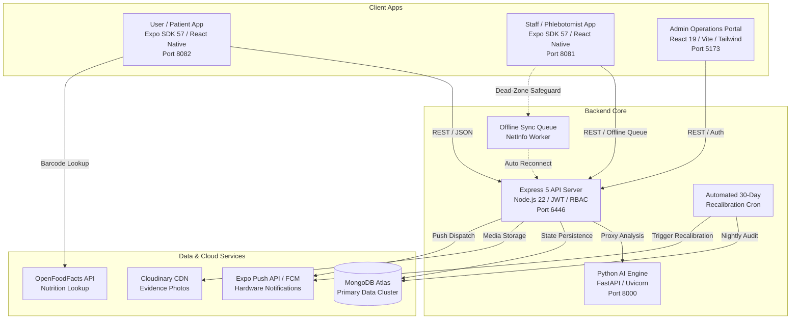

# 🧬 BioSync AI

> **Next-Generation Autonomous Diagnostic Intelligence & Home Phlebotomy Logistics Platform**

BioSync AI is a comprehensive, production-grade medical diagnostic platform bridging doorstep phlebotomy specimen logistics, 56-metric clinical pathology, real-time AI nutrition tracking, and predictive metabolic intelligence.

---

## 📑 Table of Contents

- [Executive Overview](#-executive-overview)
- [System Architecture](#-system-architecture)
- [Subsystems & Repositories](#-subsystems--repositories)
- [Key Innovations & Technical Highlights](#-key-innovations--technical-highlights)
- [Role-Based Access Control (RBAC) & Security](#-role-based-access-control-rbac--security)
- [Directory Structure](#-directory-structure)
- [Environment Configuration](#-environment-configuration)
- [Getting Started (Local Development on Windows OS)](#-getting-started-local-development-on-windows-os)
- [Production Deployment (Docker Compose)](#-production-deployment-docker-compose)
- [API & Health Endpoints](#-api--health-endpoints)
- [License](#-license)

---

## 🌟 Executive Overview

Traditional diagnostic pathology is fragmented: patients endure clinic queues, specimen tubes risk mislabeling or cold-chain decay, and lab reports sit isolated from daily nutritional habits.

**BioSync AI solves this end-to-end through 5 tightly integrated micro-applications:**
1. **Dynamic Doorstep Logistics**: Intelligent dispatch of mobile phlebotomists with real-time GPS tracking and live ETA calculations.
2. **Doorstep Cryptographic Chain-of-Custody**: Patient OTP verification, dual-barcode scanning, and photographic specimen evidence before departure.
3. **Dead-Zone Offline Safeguard**: Phlebotomist app operates in basement/rural dead-zones with automatic background queue synchronization upon reconnection.
4. **Comprehensive 56-Metric Pathology**: Complete clinical analyzer profiling covering metabolic, cardiovascular, immunology, hormonal, organ function, and micronutrient panels.
5. **Food Intelligence & Glycemic Surge Modeling**: Mobile camera meal identification and packaged product UPC/EAN barcode scanning (OpenFoodFacts) calibrated against the patient's resting baseline vitals.
6. **Automated 30-Day Recalibration Cron**: Scheduled background health audits automatically flagging stale baselines and dispatching 1-tap re-testing notifications.

---

## 🏗 System Architecture



---

## 📦 Subsystems & Repositories

### 1. `server` — Core Express REST API Engine
* **Runtime**: Node.js 22, Express 5, Mongoose 9.
* **Security**: `helmet` (cross-origin resource policies), `express-rate-limit` (brute-force defense), `cookie-parser`, `compression`, `trust proxy` configuration.
* **Lifecycle State Machine**: Strict appointment lifecycle transitions: `Booked` → `Assigned` → `On_The_Way` → `Arrived` → `Collecting` → `Sample_Collected` → `At_Laboratory` → `Completed`.
* **Hardware Push Notification Layer**: Dual-mode dispatch automatically routing Expo Push Tokens (`https://exp.host/--/api/v2/push/send`) and native FCM tokens.
* **Clinical PDF Engine**: Native `pdfkit` vector generation producing NABL-compliant verified lab reports with dynamic QR codes.
* **Automated Baseline Recalibration**: Nightly cron scanning user vitals age and emitting re-test notifications.

### 2. `ai-engine` — FastAPI Machine Learning Microservice
* **Runtime**: Python 3.11, FastAPI, Uvicorn.
* **Capabilities**: Multimodal video/frame nutritional decomposition, macro estimation (calories, carbs, protein, fats, fibers), and glycemic spike projection (`+mg/dL`).
* **Health Check**: Dedicated `/health` liveness probe for container orchestration.

### 3. `admin-panel` — Central Operations & Pathology Web Portal
* **Runtime**: React 19, Vite 8, TailwindCSS 4, Lucide React, Recharts.
* **Features**: Live dispatch map, phlebotomist duty controls, pathologist verification queue with public NABL certificate preview, system error monitoring, and revenue analytics.

### 4. `staff-panel` — Phlebotomist & Doctor Mobile Application
* **Runtime**: React Native, Expo SDK 57, Lucide Native, Tailwind Native.
* **5-Step Field Collection Wizard**:
  1. *Step 1*: Patient Doorstep OTP Verification & baseline health review.
  2. *Step 2*: Observational vitals & clinical pre-screening questions.
  3. *Step 3*: Tri-specimen collection (Blood, Urine, Stool) with **Camera Barcode Viewfinder** (`expo-camera`), cold-chain checklist, and evidence photos.
  4. *Step 4*: Payment confirmation (Cash / UPI / Online).
  5. *Step 5*: Sealed specimen handover to Central Laboratory intake.
* **Dead-Zone Offline Sync Queue**: Seamless offline caching via `@react-native-community/netinfo` and `AsyncStorage` with auto-flushing upon network reconnection.
* **Doctor Panel**: Certified pathologist mode for sample inspection, diagnostic notes, and report approval.

### 5. `user-panel` — Patient Health & Diagnostics Application
* **Runtime**: React Native, Expo SDK 57.
* **Features**: Fast-track slot booking, doorstep OTP display, live phlebotomist ETA tracking, interactive PDF report viewer, and baseline recalibration reminder badges.
* **Food Scanner**: Camera meal recognition + **Packaged Product Barcode Scanner (UPC/EAN)** querying the OpenFoodFacts database with projected glycemic response.
* **Unified Health Timeline**: Chronological stream merging diagnostic blood draws with daily meals and metabolic spikes.

---

## ⚡ Key Innovations & Technical Highlights

| Feature | Description | File References |
| :--- | :--- | :--- |
| **Dead-Zone Offline Safeguard** | Enqueues collections and lab handovers performed in basement dead-zones into persistent memory, automatically syncing upon network recovery. | [`staff-panel/.../offlineSyncQueueService.js`](staff-panel/src/services/offlineSyncQueueService.js)<br>[`staff-panel/.../OfflineSyncBanner.js`](staff-panel/src/components/OfflineSyncBanner.js) |
| **Physical Barcode Camera Viewfinder** | Active camera reticle powered by `expo-camera` (`CameraView`) for 1-tap Vacutainer tube scanning with pre-flight database uniqueness checks. | [`staff-panel/.../BarcodeScannerModal.js`](staff-panel/src/components/BarcodeScannerModal.js)<br>[`staff-panel/.../ActiveCollectionScreen.js`](staff-panel/src/screens/ActiveCollectionScreen.js) |
| **OpenFoodFacts UPC/EAN Scanner** | Barcode camera scanner in the patient app reading packaged foods and computing BioSync glycemic impact. | [`user-panel/.../FoodBarcodeScannerModal.js`](user-panel/src/components/FoodBarcodeScannerModal.js)<br>[`user-panel/.../nutritionLookupService.js`](user-panel/src/services/nutritionLookupService.js) |
| **30-Day Recalibration Cron** | Scheduled nightly cron checking patient biomarker freshness, setting `needsRecalibration`, and emitting 1-tap re-booking alerts. | [`server/services/recalibrationCron.js`](server/services/recalibrationCron.js)<br>[`server/routes/adminRoute.js`](server/routes/adminRoute.js) |
| **Hardware Push Notifications** | Universal push notification layer delivering background banners on phlebotomist arrival, specimen sealing, and report readiness. | [`server/configs/firebase.js`](server/configs/firebase.js)<br>[`server/services/notificationService.js`](server/services/notificationService.js)<br>[`user-panel/.../pushNotificationService.js`](user-panel/src/services/pushNotificationService.js) |
| **56-Metric Clinical Vitals Schema** | Full clinical analyzer profile covering metabolic, cardiovascular, immunology, hormones, organ function, and micronutrients. | [`server/models/Vitals.js`](server/models/Vitals.js)<br>[`staff-panel/.../VitalsFormSection.js`](staff-panel/src/components/VitalsFormSection.js) |

---

## 🛡️ Role-Based Access Control (RBAC) & Security

BioSync AI enforces zero-trust data access across all touchpoints with strict cryptographic and protocol boundaries:

| Persona | Authentication Mechanism | Permissions & Scope |
| :--- | :--- | :--- |
| **Super Admin** | Bcrypt-hashed password + JWT Bearer Auth | Complete platform visibility: operations dispatch, revenue analytics, audit logs, user management, and cron triggers. |
| **Operations Manager** | Bcrypt-hashed password + JWT Bearer Auth | Fleet management, phlebotomist dispatch, customer support/helpline dispute triage. |
| **Pathologist / Doctor** | Secure phone authentication + Staff JWT | Clinical verification queue, anomaly annotation, and electronic signature authorization on laboratory certificates. |
| **Phlebotomist (Staff)** | Secure phone authentication + Staff JWT | Geofenced appointment assignments, specimen collection wizard, cold-chain compliance logging, and lab handovers. |
| **Patient User** | Dynamic Phone OTP Verification + Session JWT | Personal appointment scheduling, live technician tracking, digital lab reports, and AI nutritional diary. |

> **Security Note**: All passwords are encrypted using `bcryptjs` with salt work factor 10. API endpoints are guarded by rate limiters, HTTP-only cookie headers, Cross-Origin Resource Policy (CORP), and JSON Web Tokens. Initial administrative provisioning is performed securely via deployment environment variables.

---

## 📂 Directory Structure

```text
BIO_SYNC_AI/
├── admin-panel/              # React 19 + Vite Admin & Pathology Web Portal
│   ├── src/
│   │   ├── api/              # Axios instance & certificate view helpers
│   │   ├── components/       # UI Cards, Sidebar, Header, Modals
│   │   ├── pages/            # Dashboard, Appointments, Reports, Analytics
│   │   └── store/            # State management
│   ├── Dockerfile            # Multi-stage Vite build + Nginx static server
│   ├── nginx.conf            # SPA fallback & asset caching configuration
│   └── package.json
│
├── ai-engine/                # Python FastAPI Microservice
│   ├── main.py               # Nutritional analysis & glycemic projection API
│   ├── requirements.txt      # FastAPI, Uvicorn, Python-Multipart, Pydantic
│   └── Dockerfile            # Python 3.11 Slim container configuration
│
├── server/                   # Core Express Backend API Server
│   ├── configs/              # MongoDB, Cloudinary, Mailer, Firebase/Expo Push
│   ├── controllers/          # Users, Vitals, Appointments, Staff, Admin, Food
│   ├── middlewares/          # JWT Auth, RBAC, Rate Limiting, Audit Logger
│   ├── models/               # Mongoose schemas (56-metric Vitals, Appointments)
│   ├── routes/               # Express router endpoints
│   ├── services/             # Recalibration Cron, PDF Kit Report Generator, Push
│   ├── utils/                # Distance assignment, AI feature extraction
│   ├── Dockerfile            # Node 22 Alpine production container
│   ├── server.js             # Main entry point with /health and graceful shutdown
│   └── package.json
│
├── staff-panel/              # Phlebotomist & Doctor React Native App
│   ├── src/
│   │   ├── api/              # Staff API & dynamic host URL resolution
│   │   ├── components/       # Camera Barcode Scanner, Offline Sync Banner
│   │   ├── navigation/       # Phlebotomist & Doctor tab navigators
│   │   ├── screens/          # 5-Step ActiveCollectionScreen, Dashboard, Schedule
│   │   ├── services/         # Offline sync queue, Draft persistence, Navigation
│   │   └── store/            # Zustand state management
│   ├── app.json              # Native package, camera & notification permissions
│   └── package.json
│
├── user-panel/               # Patient React Native App
│   ├── src/
│   │   ├── api/              # User API & dynamic baseURL resolution
│   │   ├── components/       # Food barcode scanner, Data provenance badges
│   │   ├── navigation/       # Bottom tabs & stack navigation
│   │   ├── screens/          # FoodScannerScreen, Unified HealthTimeline, Reports
│   │   ├── services/         # OpenFoodFacts lookup, Push notifications
│   │   └── store/            # User appointment & auth stores
│   ├── app.json              # Native package, camera & location permissions
│   └── package.json
│
├── docker-compose.yml        # Orchestration for Server, AI Engine & Admin Panel
├── ecosystem.config.cjs      # PM2 cluster configuration for Linux VPS
└── .gitignore                # Production exclusions (Assets, Secrets, Node Modules)
```

---

## 🔑 Environment Configuration

Each subsystem reads from its own environment variables. Standard configuration templates (`.env.example`) are provided in each subsystem directory.

### `server/.env`
```env
PORT=6446
NODE_ENV=production
PUBLIC_URL=http://localhost:6446
CLIENT_URL=http://localhost:5173
ADMIN_URL=http://localhost:5173
MONGO_URI=mongodb+srv://<username>:<password>@cluster0.mongodb.net/biosync_db
JWT_SECRET=your_jwt_secret_key
GEMINI_API_KEY=your_gemini_api_key
AI_ENGINE_URL=http://localhost:8000/api/v1/analyze
CLOUDINARY_CLOUD_NAME=your_cloudinary_name
CLOUDINARY_API_KEY=your_cloudinary_key
CLOUDINARY_API_SECRET=your_cloudinary_secret
FAST2SMS_API_KEY=your_fast2sms_key
EMAIL_USER=your_email@gmail.com
EMAIL_APP_PASSWORD=your_email_app_password
RECALIBRATION_CRON_SCHEDULE=0 2 * * *
```

### `admin-panel/.env`
```env
VITE_API_URL=http://localhost:6446/api
```

### `staff-panel/.env`
```env
EXPO_PUBLIC_API_URL=http://<YOUR_LAN_IP_OR_HOST>:6446/api
EXPO_PUBLIC_GOOGLE_MAPS_KEY=your_google_maps_key
```

### `user-panel/.env`
```env
EXPO_PUBLIC_API_URL=http://<YOUR_LAN_IP_OR_HOST>:6446/api
EXPO_PUBLIC_HOST_IP=<YOUR_LAN_IP_OR_HOST>
```

### `ai-engine/.env`
```env
AI_ENGINE_HOST=0.0.0.0
AI_ENGINE_PORT=8000
CORS_ORIGINS=*
```

---

## 💻 Getting Started (Local Development on Windows OS)

Open separate PowerShell windows for each subsystem:

### Terminal 1: Backend Express Server
```powershell
cd server
npm install
npm run server
```
*Health Check*: `http://localhost:6446/health`

### Terminal 2: Python FastAPI AI Engine
```powershell
cd ai-engine
pip install -r requirements.txt
python -m uvicorn main:app --reload --host 0.0.0.0 --port 8000
```
*API Documentation*: `http://localhost:8000/docs`

### Terminal 3: Admin Operations Web Portal
```powershell
cd admin-panel
npm install
npm run dev
```
*Access Portal*: `http://localhost:5173`

### Terminal 4: Staff / Phlebotomist Mobile App (Metro)
```powershell
cd staff-panel
npm install
npx expo start -c --port 8081
```
*Controls*: Press `a` for Android Emulator, or scan the QR code with Expo Go.

### Terminal 5: Patient User Mobile App (Metro)
```powershell
cd user-panel
npm install
npx expo start -c --port 8082
```
*Controls*: Press `a` for Android Emulator, or scan the QR code with Expo Go.

---

## 🐳 Production Deployment (Docker Compose)

To spin up the Backend API, Python AI Engine, and Admin Panel web app in the background with persistent volumes:

```bash
docker compose up --build -d
```

Check container status:
```bash
docker compose ps
```

Stream aggregated logs:
```bash
docker compose logs -f
```

Stop services:
```bash
docker compose down
```

---

## 🔍 API & Health Endpoints

| Endpoint | Method | Service | Description |
| :--- | :--- | :--- | :--- |
| `/health` | `GET` | Server (`6446`) | MongoDB connection state, uptime, environment probe |
| `/api/tests` | `GET` | Server (`6446`) | Active clinical test catalog and fasting instructions |
| `/api/appointments/:id/report/view` | `GET` | Server (`6446`) | Public NABL digital certificate viewer |
| `/api/appointments/:id/report/pdf` | `GET` | Server (`6446`) | Direct binary PDF report download |
| `/api/admin/trigger-recalibration-cron` | `POST` | Server (`6446`) | Manually triggers the 30-day baseline recalibration audit |
| `/health` | `GET` | AI Engine (`8000`) | Microservice liveness and worker probe |
| `/api/v1/analyze` | `POST` | AI Engine (`8000`) | Multimodal video/photo meal analysis endpoint |

---

## 📄 License

This project is licensed under the **ISC License**. Developed as a production-grade diagnostic intelligence and phlebotomy logistics platform.
